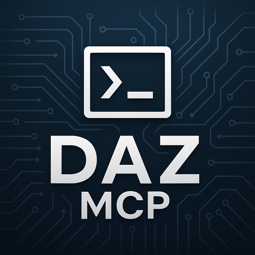

# DAZ Command MCP Server



*A Model Context Protocol (MCP) server that provides session-based command execution with intelligent LLM-powered summarization.*

---

## 🚀 Features

- **🔧 Session Management**: Create, open, and manage isolated command execution sessions
- **⚡ Command Execution**: Run shell commands with timeout controls and working directory management  
- **📁 File Operations**: Read and write text files with comprehensive error handling
- **🤖 LLM Summarization**: Automatic session progress tracking using structured LLM responses
- **📋 Event Logging**: Complete audit trail of all operations within sessions
- **🔒 Thread-Safe**: Robust concurrent operation with proper synchronization

## 📦 Installation

### Prerequisites

- Python 3.8+
- `fastmcp` library
- `dazllm` library for LLM integration

### Quick Setup

1. **Clone this repository:**
```bash
git clone https://github.com/yourusername/daz-command-mcp.git
cd daz-command-mcp
```

2. **Install dependencies:**
```bash
pip install -r requirements.txt
```

3. **Configure your LLM model** in the script (default: `lm-studio:openai/gpt-oss-20b`)

## 🎯 Usage

### Starting the Server

```bash
python main.py
```

### Available Tools

#### Session Management

- **`daz_sessions_list()`** - List all sessions and identify the active one
- **`daz_session_create(name, description)`** - Create and activate a new session
- **`daz_session_open(session_id)`** - Open and activate an existing session  
- **`daz_session_current()`** - Get details of the currently active session
- **`daz_session_close()`** - Close the current session
- **`daz_session_rename(old_name, new_name)`** - Rename an existing session
- **`daz_session_delete(session_name)`** - Delete a session by moving to deleted_sessions

#### Command & File Operations

All command and file operations require an active session and context parameters:

- **`daz_command_cd(directory, current_task, summary_of_what_we_just_did, summary_of_what_we_about_to_do)`** - Change working directory
- **`daz_command_read(file_path, current_task, summary_of_what_we_just_did, summary_of_what_we_about_to_do)`** - Read a text file
- **`daz_command_write(file_path, content, current_task, summary_of_what_we_just_did, summary_of_what_we_about_to_do)`** - Write a text file
- **`daz_command_run(command, current_task, summary_of_what_we_just_did, summary_of_what_we_about_to_do, timeout=60)`** - Execute shell commands

#### Learning & Instructions

- **`daz_add_learnings(learning_info)`** - Add important discoveries and context to the session
- **`daz_instructions_read()`** - Read current session instructions
- **`daz_instructions_add(instruction)`** - Add a new instruction to the session
- **`daz_instructions_replace(instructions)`** - Replace all instructions with a new list
- **`daz_record_user_request(user_request)`** - Record a user request at the start of multi-step tasks

### Example Workflow

```python
# Create a new session
daz_session_create("Setup Project", "Setting up a new Python project with dependencies")

# Navigate to project directory  
daz_command_cd("/path/to/project", 
               "Setting up Python project",
               "Created new session for project setup", 
               "Navigate to project root directory")

# Run commands
daz_command_run("pip install -r requirements.txt",
                "Setting up Python project", 
                "Navigated to project directory",
                "Install project dependencies")

# Read configuration
daz_command_read("config.json",
                 "Setting up Python project",
                 "Installed dependencies successfully", 
                 "Review current configuration settings")

# Write new file
daz_command_write("setup.py", "...",
                  "Setting up Python project",
                  "Reviewed configuration file",
                  "Create package setup file")
```

## 🏗️ Architecture

### Session Storage

Sessions are stored as JSON files in the `sessions/` directory with the following structure:

```json
{
  "id": "unique-session-id",
  "name": "Session Name", 
  "description": "Detailed description",
  "created_at": 1692123456.789,
  "updated_at": 1692123456.789,
  "summary": "LLM-generated summary",
  "progress": "Current progress status",
  "current_directory": "/current/working/dir",
  "events_count": 42
}
```

### Event Logging

Every operation is logged with comprehensive details in `event_log.jsonl`:

```json
{
  "timestamp": 1692123456.789,
  "type": "run|read|write|cd|user_request|learning",
  "current_task": "The task being worked on",
  "summary_of_what_we_just_did": "What was just completed",
  "summary_of_what_we_about_to_do": "What's planned next",
  "inputs": {...},
  "outputs": {...}, 
  "duration": 0.123
}
```

### LLM Integration

The server uses asynchronous LLM processing to maintain session summaries:

- **🔄 Background Processing**: Summarization runs in a separate thread
- **🛡️ Fault Tolerance**: LLM failures don't affect MCP operations
- **📋 Structured Output**: Uses Pydantic models for reliable parsing
- **⚙️ Configurable Model**: Easy to switch between different LLM providers

## ⚙️ Configuration

### LLM Model

Edit the `LLM_MODEL_NAME` constant in `src/models.py`:

```python
LLM_MODEL_NAME = "your-model-name"
```

### Session Directory

Sessions are stored in `./sessions/` by default. This can be modified by changing the `SESSIONS_DIR` constant in `src/models.py`.

## 🛠️ Error Handling

- **🔄 Graceful Degradation**: Operations continue even if LLM summarization fails
- **📝 Comprehensive Logging**: All errors are logged to stderr
- **✅ Input Validation**: Robust parameter checking and sanitization
- **🔒 File Safety**: Atomic file operations prevent corruption

## 🔗 Integration

This MCP server integrates with Claude Desktop and other MCP-compatible clients. Add it to your MCP configuration:

```json
{
  "mcpServers": {
    "daz-command": {
      "command": "python",
      "args": ["/path/to/main.py"]
    }
  }
}
```

## 📁 Project Structure

```
daz-command-mcp/
├── README.md              # This file
├── main.py                # Entry point
├── requirements.txt       # Dependencies
├── images/                # Documentation images
├── sessions/              # Session storage (auto-created)
└── src/                   # Source code
    ├── __init__.py
    ├── command_executor.py    # Command execution logic
    ├── history_manager.py     # Session history management
    ├── mcp_tools.py          # MCP tool definitions
    ├── models.py             # Data models and constants
    ├── session_manager.py    # Session lifecycle management
    ├── summary_generator.py  # LLM summary generation
    ├── summary_worker.py     # Background summarization worker
    ├── utils.py              # Utility functions
    └── tests/                # Unit tests
        ├── test_add_learnings.py
        ├── test_initialization_fix.py
        ├── test_llm_system_integration.py
        ├── test_new_parameter_system.py
        └── test_summary_generation.py
```

## 🧪 Testing

Run the comprehensive test suite:

```bash
# Run all tests
python -m pytest src/tests/

# Run specific test
python -m pytest src/tests/test_summary_generation.py -v

# Run with coverage
python -m pytest src/tests/ --cov=src
```

## 🤝 Contributing

1. Fork the repository
2. Create a feature branch (`git checkout -b feature/amazing-feature`)
3. Make your changes
4. Add tests if applicable
5. Commit your changes (`git commit -m 'Add amazing feature'`)
6. Push to the branch (`git push origin feature/amazing-feature`)
7. Submit a pull request

## 📜 License

[Add your license here]

## 📦 Dependencies

- **fastmcp**: MCP server framework
- **dazllm**: LLM integration library

## 💬 Support

For issues and questions, please open an issue on GitHub or contact [your contact information].

---

*Built with ❤️ for the Model Context Protocol ecosystem*
